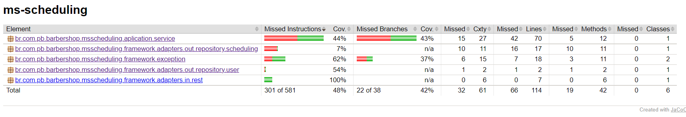
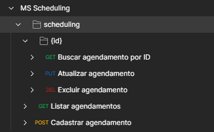

# MS Scheduling


- URL: http://localhost:8081/api/barbershop/scheduling
- [Swagger - OpenAPI](https://github.com/pbBarbershop/ms-user/blob/master/src/main/resources/openapi.yaml)
- MySQL Workbench
- [Dockerfile](https://github.com/pbBarbershop/ms-scheduling/blob/master/Dockerfile)





## Exemplo de cURL

### POST - Cadastrar Agendamento

`/scheduling`

```cURL
curl --location --request POST 'http://localhost:8082/api/barbershop/scheduling' \
--header 'Content-Type: application/json' \
--header 'Accept: application/json' \
--data-raw '{
  "barberId": -75553414,
  "customerId": 59933721,
  "dateTime": "1996-09-28T17:10:50.830Z",
  "status": "AGUARDANDO_PAGAMENTO",
  "service": "CABELO_BARBA"
}'
```

### GET - Listar Agendamentos

`/scheduling?customerId=-11861197&barberId=98246360&dateTime=2022-12-22T19:51:17.356Z&service=BARBA&page=29259986&size=21833896&sort=["enim aute et","laboris elit"]`

```cURL
curl --location -g --request GET 'http://localhost:8082/api/barbershop/scheduling?customerId=-11861197&barberId=98246360&dateTime=2022-12-22T19:51:17.356Z&service=BARBA&page=29259986&size=21833896&sort=["enim aute et","laboris elit"]' \
--header 'Accept: application/json'
```

### GET - Listar Agendamento

`/scheduling/:id`

```cURL
curl --location --request GET 'http://localhost:8082/api/barbershop/scheduling/96900554' \
--header 'Accept: application/json'
```

### DEL - Excluir Agendamento

`/scheduling/:id`

```cURL
curl --location --request DELETE 'http://localhost:8082/api/barbershop/scheduling/96900554' \
--header 'Accept: application/json'
```

### PUT - Atualizar Agendamento

`/scheduling/:id`

```cURL
curl --location --request PUT 'http://localhost:8082/api/barbershop/scheduling/96900554' \
--header 'Content-Type: application/json' \
--header 'Accept: application/json' \
--data-raw '{
  "barberId": -75553414,
  "customerId": 59933721,
  "dateTime": "1996-09-28T17:10:50.830Z",
  "status": "AGUARDANDO_PAGAMENTO",
  "service": "CABELO_BARBA"
}'
```

